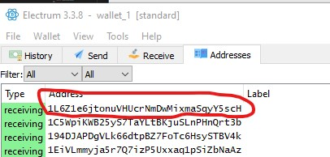

The project is based on bitcoin to verify the signature and identify that the address belongs to the user this mechanism can be used to store
any digital asset for example encodedDocument to know that certain document belongs to which user(address) . It uses the Level Database and express framework.
Requirements:-
1-Node.js
2-Electrum  (Or any other bitcoin wallet)
3-Postman

Main Project is in Project_Blockchain Folder folder.

To execute the project clode this repo and change directory to Project_Blockchain.

Steps:-
1- npm install (This is to install all the dependencies)

2- npm start (To start the blockchain server)

Working with blockchain:-

1- localhost.3000/requestValidation (Parameters:-  Address)

Iam going to use first address from my electrum wallet for demonstration

When you will hit send you will get the response like this

Then copy the message from response without quotes and use it to get the signature from electrum wallet this will identify that you are the true owner of the address

2- localhost:3000/validate-signature (Parameters:- Address, Signature)

Use the signature that you got from electrum

This will give you the response Signature is true if it is correct if not then it will respond false.

After all these steps are done and signature is verified then now I will demonstarte how any digital asset can be stored on blockchain

3- localhost:3000/block (Parameters:- Address, asset)

This will give the response Added block with the blockchain Height. And in this way Digital asset can be stored on the blockchain

To view Blockdata it can be accessed using GET in following ways:-

1:- localhost:3000/block/1 (Accessing Block by height)

2:-  localhost:3000/block/address/1L6Z1e6jtonuVHUcrNmDwMixmaSqyY5scH  (Accessing Block by address)

3:- localhost:3000/block/hash/3811cec7f483aa6ad8c6e4cf9aef5f8c84fcf9fd9d7b2c0b8071bf9a0a60cf45 (Accessing Block by hash)

At any point to check data before entering the asset use:-
localhost:3000/asset

